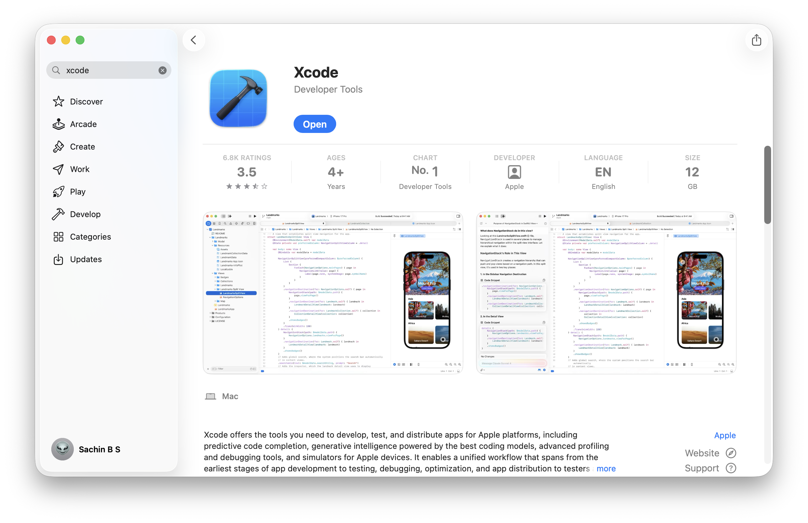
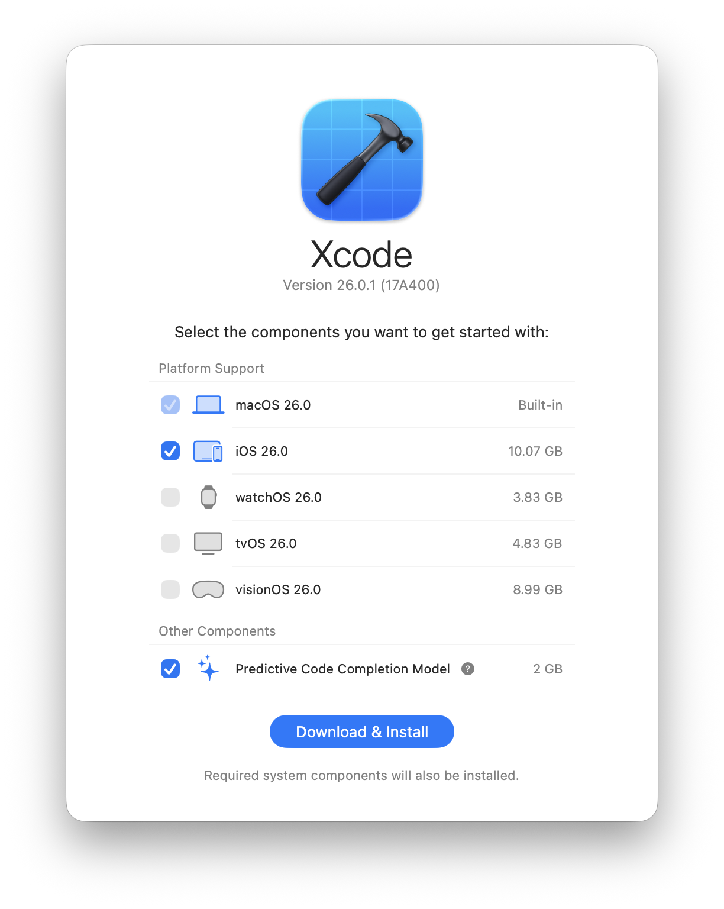
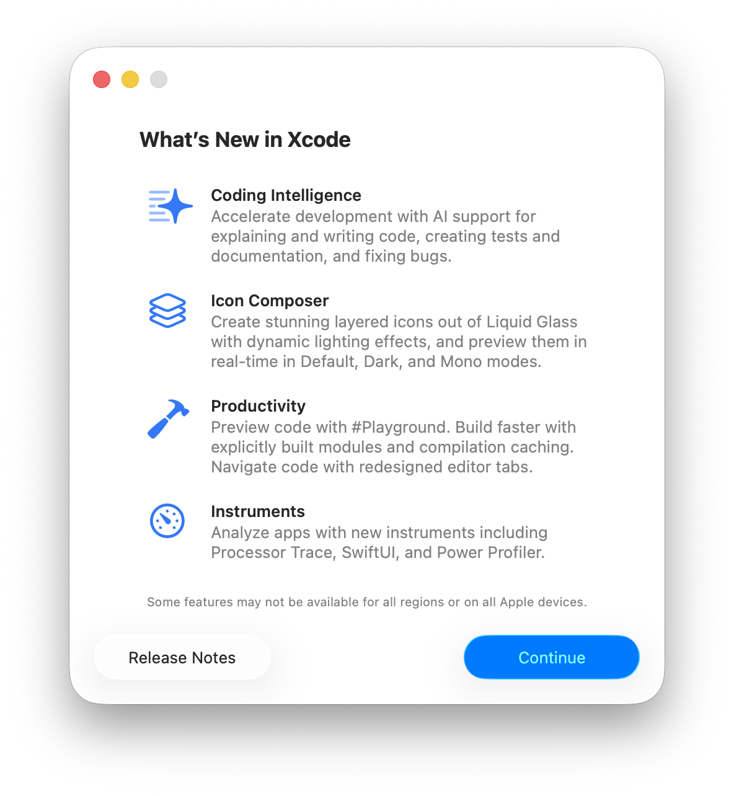
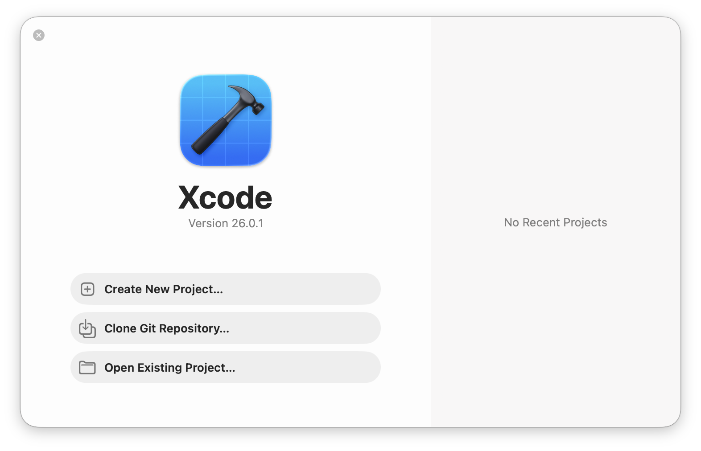
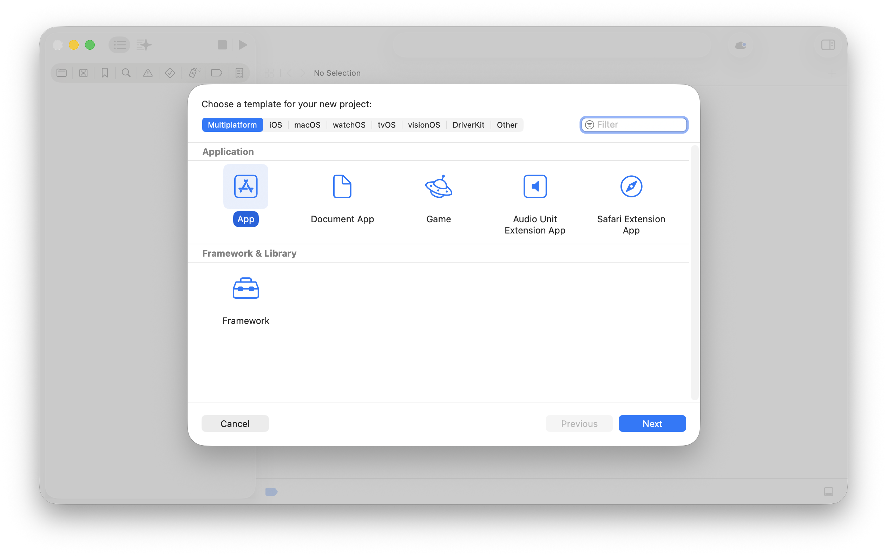
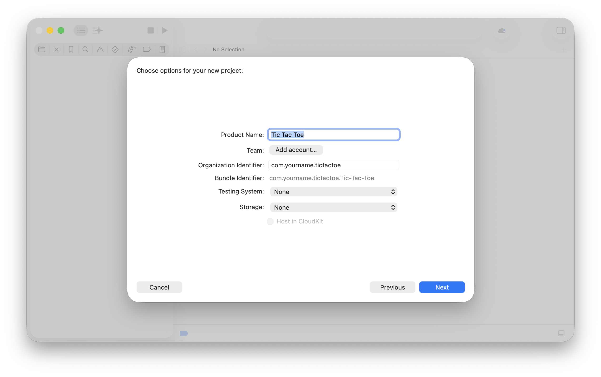
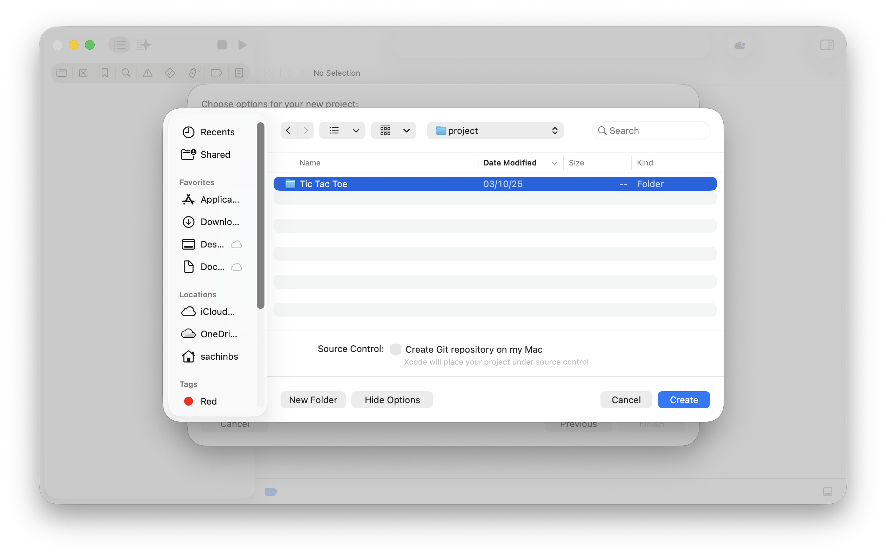
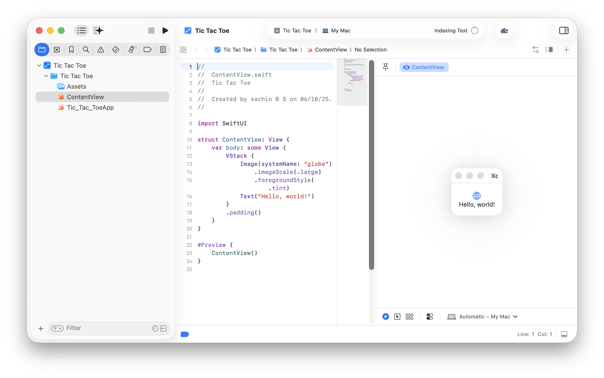
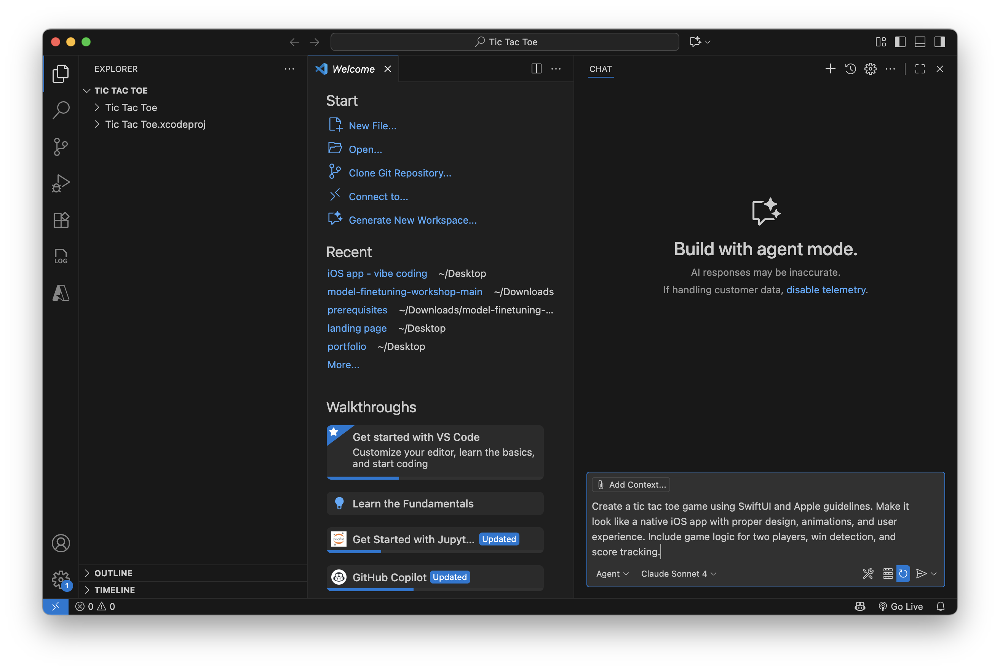

# iOS App Development with Vibe Coding 🚀


> **Create iOS apps without writing code from scratch!** This beginner-friendly guide shows you how to build your first iPhone app using AI assistance. Perfect for designers, product managers, and anyone with basic computer skills.

## 🎯 What You'll Learn

By following this guide, you will:
- ✅ Install the necessary tools to create iOS apps
- ✅ Set up your first iOS project (like creating a new document)
- ✅ Use AI (Vibe Coding) to generate app code by describing what you want in plain English
- ✅ See your app running on an iPhone simulator (a virtual iPhone on your computer)
- ✅ Test your app on your actual iPhone or iPad
- ✅ Build any app you can imagine using natural language descriptions

**No programming experience needed!** You'll use AI to write the code for you — just describe what you want your app to do.

## 💡 How It Works

**Vibe Coding** is like having a conversation with an AI assistant that builds apps for you:

1. **You describe** what you want: *"Create a to-do list app with a clean design"*
2. **AI generates** the code automatically
3. **You see** your app come to life instantly
4. **You refine** by asking for changes: *"Make the buttons bigger and blue"*

Think of it as talking to an expert developer who instantly creates what you describe!

## 🚀 Quick Start Summary

**Don't want to read everything? Here's the super quick version:**

1. **Download Xcode** from Mac App Store (free, ~15GB download)
2. **Create a new project** in Xcode (choose "App" template)
3. **Open project in VS Code** (File > Open Folder)
4. **Install GitHub Copilot** in VS Code (requires subscription, free trial available)
5. **Describe your app** to the AI in natural language
6. **Build and run** by asking AI: "Build and run my iOS app in the simulator"
7. **Test and refine** - ask the AI to make changes until you're happy!

⏱️ **Total time:** 1-2 hours for first setup (includes downloads), then 10-30 minutes per app!

**Want detailed instructions?** Keep reading below!

## 📚 Table of Contents
- [Glossary - Understanding Key Terms](#-glossary---understanding-key-terms)
- [System Requirements](#system-requirements)
- [What You Need Before Starting](#what-you-need-before-starting)
- [1. Getting Started](#1-getting-started)
- [2. Build and Run Your App](#2-build-and-run-your-app)
- [3. Test Your App on a Real Device](#3-test-your-app-on-a-real-device)
- [4. Create a New Project with Vibe Coding](#4-create-a-new-project-with-vibe-coding)
- [Next Steps](#next-steps)
- [Frequently Asked Questions (FAQ)](#-frequently-asked-questions-faq)
- [Troubleshooting](#troubleshooting)
- [Resources](#resources)

## 📖 Glossary - Understanding Key Terms

Before we begin, let's understand some terms you'll encounter:

- **iOS:** The operating system that runs on iPhones and iPads (like Windows runs on PCs)
- **Xcode:** Apple's official app-building software (like Microsoft Word, but for creating apps)
- **VS Code (Visual Studio Code):** A code editor where you'll work with AI to create your app
- **SwiftUI:** Apple's modern way of designing app interfaces (you won't need to learn it - AI will handle it!)
- **Simulator:** A virtual iPhone/iPad that runs on your Mac for testing (no real device needed)
- **GitHub Copilot:** The AI assistant that writes code based on your descriptions
- **Vibe Coding:** The method of creating apps by having a conversation with AI
- **Agent Mode:** A special AI mode that can perform multiple tasks automatically
- **Build:** The process of converting your app design into a working application
- **Deploy:** Putting your app onto a device (simulator or real iPhone/iPad)

💡 **Don't worry if these terms seem new** - they'll make sense as you follow along!

## 💻 System Requirements

**What kind of computer do you need?**

You'll need a Mac computer to build iOS apps. Here's what works:
- **macOS:** macOS 13.0 (Ventura) or newer
  - *Not sure which version you have?* Click the Apple logo (🍎) at the top-left of your screen, then "About This Mac"
- **Mac Type:** Any Mac from the last few years will work:
  - MacBook Air or MacBook Pro
  - iMac or Mac mini
  - Mac Studio or Mac Pro
- **Storage:** At least 15GB of free space
  - *Check your storage:* Click the Apple logo → "About This Mac" → "Storage"
- **Internet:** You'll need a good internet connection to download software (about 10-15 GB total)

⚠️ **Important:** You cannot build iOS apps on Windows or Linux computers - you need a Mac.

## ✅ What You Need Before Starting

**Before you start, make sure you have:**

### Required (Must Have)
- ✅ **A Mac computer** - See system requirements above
- ✅ **Apple ID** - The same account you use for iCloud or App Store
  - *Don't have one?* You can create one for free at [appleid.apple.com](https://appleid.apple.com)
- ✅ **Internet connection** - For downloading Xcode (10-15 GB) and VS Code
- ✅ **About 1-2 hours** - For installation and following this guide

### Software to Install (We'll help you install these)
- 📦 **Xcode** - Apple's app builder (we'll show you how to download it)
- 📦 **VS Code** - Where you'll use AI to create your app ([Download here](https://code.visualstudio.com/))
- 📦 **GitHub Copilot** - The AI that writes code for you
  - *Note:* This may require a GitHub account and subscription, but you can [try it free](https://github.com/features/copilot)

### Optional (Nice to Have)
- 📱 **iPhone or iPad** - To test your app on a real device (optional - you can use the simulator)
- 📱 **USB cable** - To connect your device to your Mac

💡 **New to all this?** Don't worry! This guide assumes no prior experience. Just follow each step, and you'll be creating apps in no time!

## 1. Getting Started

**In this section, you'll install Xcode (Apple's app-building software) and create your first iOS project.**

⏱️ **Time needed:** About 30-45 minutes (most of it is waiting for downloads)

### 1.1 Download and Install Xcode

**Xcode is Apple's free app-building software.** Think of it as the foundation for creating iPhone and iPad apps.

**Follow these steps:**

1. **Open the Mac App Store**
   - Click the App Store icon in your Dock (bottom of screen), OR
   - Click this link: [Download Xcode from Mac App Store](https://apps.apple.com/in/app/xcode/id497799835?mt=12)

2. **Search for Xcode** (if you didn't use the link above)
   - In the App Store, type `"Xcode"` in the search box
   - Click on the Xcode app with the blue icon

3. **Download Xcode**
   - Click the `"Get"` or `"Install"` button
   - You may need to enter your Apple ID password
   - ⏳ **Wait for download** - This is a large file (10-15 GB) and may take 30-60 minutes depending on your internet speed
   - ☕ This is a good time for a coffee break!

4. **Open Xcode**
   - Once downloaded, click `"Open"` in the App Store, OR
   - Find Xcode in your Applications folder and double-click it



✅ **Success indicator:** Xcode should launch and show you a welcome screen.

### 1.2 Set Up Xcode Components

**When Xcode opens for the first time, it needs to download additional tools.**

**What you'll see:**
- A screen asking you to download iOS components (tools for building iPhone apps)
- This is normal and expected!

**What to do:**
1. **Select the components:**
   - Make sure `iOS 26.0` (or latest version) is checked ✓
   - Also check `Predictive Code Completion Model` (helps with AI coding)
   - Leave other default selections as they are

2. **Start the download:**
   - Click `"Download & Install"`
   - ⏳ This will download in the background (may take 10-20 minutes)
   - You can continue to the next step while this downloads

3. **Continue setup:**
   - When you see "What's New in Xcode", click `"Continue"`

| Component Selection Screen | Continue Screen |
|:---:|:---:|
|  |  |

✅ **Success indicator:** You should see the Xcode welcome screen with options to create a new project.

💡 **Tip:** If downloads seem stuck, check your internet connection. You can safely close and reopen Xcode - it will resume where it left off.

### 1.3 Create Your First iOS Project

**Now you'll create a new app project.** Think of this as creating a new folder where your app will live.

**Steps:**
1. On the Xcode start screen, click `"Create New Project..."` 
   - It's a large blue button - you can't miss it!



✅ **What happens next:** Xcode will ask you what kind of app you want to create.

### 1.4 Choose What Type of App You're Building

**Xcode offers many templates.** For learning, we'll use the simplest one - a basic app.

**Steps:**
1. At the top, make sure `"Multiplatform"` is selected
   - This means your app can work on iPhone, iPad, and even Mac!
   
2. In the **Application** section, click on `"App"`
   - This is the basic app template - perfect for beginners

3. Click `"Next"` at the bottom right



✅ **Success indicator:** You'll move to a screen asking for your app's details.

### 1.5 Name Your App and Configure Settings

**Now you'll give your app a name and set some basic information.**

**What each field means:**
- **Product Name:** What your app is called (example: "Tic Tac Toe", "My First App", "Weather Helper")
  - Use letters, numbers, and spaces
  - This is what users will see on their iPhone

- **Organization Identifier:** A unique ID for your apps (example: "com.yourname.appname")
  - Think of it like a reverse website address
  - Format: `com.yourname.appname` (replace "yourname" with your name)
  - Example: If your name is John and app is "Tic Tac Toe", use: `com.john.tictactoe`

**Steps:**
1. **Product Name:** Type your app name (e.g., "Tic Tac Toe")
2. **Organization Identifier:** Type something like "com.yourname.tictactoe"
   - All lowercase, no spaces
3. **Leave all other settings as they are** - the defaults are perfect for beginners!
4. Click `"Next"`



✅ **Success indicator:** You'll see a file browser asking where to save your project.

### 1.6 Choose Where to Save Your Project

**You need to tell Xcode where to save your app's files on your Mac.**

**Recommended locations:**
- **Desktop** - Easy to find
- **Documents** folder - Keeps things organized

**Steps:**
1. **Navigate to your preferred location:**
   - Click on "Desktop" or "Documents" in the left sidebar, OR
   - Navigate to any folder you prefer

2. **Keep "Create Git repository on my Mac" checked** ✓
   - Git is a safety feature that tracks changes to your app
   - Like "Track Changes" in Microsoft Word - helpful but you can ignore it for now

3. **Click `"Create"`** to create your project!



**What Xcode will create:**
- A new folder with your app's name (e.g., "Tic Tac Toe")
- All the files needed for your app inside that folder

✅ **Success indicator - You should now see:**
- **Left side:** Your project files (like a file explorer)
- **Center:** Code with colorful text (this is Swift code - the AI will handle it!)
- **Right side:** A preview showing "Hello, world!" - this is what your app looks like!



---
<div align="center">
  
**🎉 Excellent! Your iOS project is created and ready! 🎉**

**Next, we'll move to VS Code where the AI magic happens!**

</div>

---
<br />

### 1.7 Open Your Project in VS Code (Where the AI Works!)

**Now we'll open your project in VS Code - this is where you'll use AI to build your app.**

**Why VS Code?** It's where GitHub Copilot (the AI) works best. You'll describe what you want, and the AI will write the code!

**Steps:**

1. **Open Visual Studio Code**
   - Find it in your Applications folder, OR
   - Use Spotlight: Press `Cmd + Space`, type "Visual Studio Code", press Enter

2. **Open your project folder:**
   - In VS Code, click `File` in the menu bar at the top
   - Click `Open Folder` (or press `Cmd + O`)
   - Navigate to where you saved your project (Desktop or Documents)
   - Click on your project folder (e.g., "Tic Tac Toe")
   - Click `"Open"` or `"Select"`

**Now let's use AI to build an actual app!**

🎯 **Example: We'll create a Tic Tac Toe game** - but you can create anything you want!


*This is what VS Code looks like with the AI assistant*

**Activate the AI Assistant:**

1. **Open GitHub Copilot Chat:**
   - Look for the chat icon on the right side of VS Code
   - Click it to open the chat panel

2. **Switch to "Agent Mode":**
   - In the chat panel, click where it says "agent mode"
   - Agent mode lets the AI do multiple tasks automatically (very powerful!)

3. **Describe what you want to build:**
   - Copy and paste this prompt in the chat:

```swift
Create a tic tac toe game using SwiftUI and Apple guidelines. Make it look like a native iOS app with proper design, animations, and user experience. Include game logic for two players, win detection, and score tracking.
```

4. **Let the AI work:**
   - Press Enter
   - The AI will analyze your project and start writing code
   - You'll see it make changes to your files automatically
   - This might take 1-2 minutes

5. **Review the changes:**
   - The AI will show you what it changed
   - You can click to review each change
   - If you're happy with it, accept the changes

✅ **Success indicator:** You should see new code in your project files, and the AI should tell you it's complete!

💡 **Pro tip:** The more specific you are in your description, the better the results! Instead of "make an app", try "Create a to-do list app with blue buttons and checkboxes"

## 2. Build and Run Your App

**Now the exciting part - let's see your app in action!**

⏱️ **Time needed:** About 2-5 minutes

**What is "building"?** Building is when the computer converts your app code into an actual working app. Think of it like baking - you have the recipe (code), now you need to bake it (build it) to get the cake (working app).

**What is the "Simulator"?** It's a virtual iPhone that runs on your Mac. You don't need a real iPhone to test your app!

### The Easy Way - Let AI Do It!

**In the GitHub Copilot chat (where you just created your app), simply type:**

```
Build and run my iOS app in the simulator
```

**Then press Enter and wait.** The AI will:
1. Build your app (convert code to a working app)
2. Launch the iOS Simulator (virtual iPhone)
3. Install and run your app on it

⏳ **This might take 1-2 minutes the first time** - be patient!

✅ **Success indicator:** You should see:
- A virtual iPhone appear on your screen (the Simulator)
- Your app launch and run on that virtual iPhone
- If you created the Tic Tac Toe game, you should see the game board!

### If You See Errors

**Don't worry - errors are normal!** The AI will usually fix them automatically.

**If the AI suggests fixes:**
- Read what it suggests
- Click "Accept" or "Apply" to let it fix the issues
- Try building again by typing: `Build and run my iOS app in the simulator`

💡 **Common first-time issues the AI will fix:**
- Missing packages or imports
- Code syntax corrections
- Configuration adjustments

**If the app builds successfully, congratulations! 🎉 You just created and ran your first iOS app!**

## 3. Test Your App on a Real Device (Optional)

**Want to see your app on your actual iPhone or iPad?** Here's how!

⏱️ **Time needed:** About 10-15 minutes (first time only)

💡 **Note:** This step is completely optional. The Simulator works great for testing. Only do this if you have an iPhone/iPad and want to try your app on it.

**What you'll need:**
- An iPhone or iPad
- A USB cable to connect it to your Mac
- Your device unlocked and with you

### Step-by-step Guide

#### Step 1: Connect Your Device

1. **Plug in your iPhone/iPad** to your Mac using a USB cable
2. **Unlock your device** (enter your passcode if it's locked)
3. **Trust your computer:**
   - A message will pop up on your iPhone/iPad saying "Trust This Computer?"
   - Tap `"Trust"`
   - Enter your device passcode if asked

✅ **Success indicator:** Your device should appear in Xcode when you open it.

#### Step 2: Enable Developer Mode (First Time Only)

**This tells your iPhone/iPad it's okay to run apps you're developing.**

**On your iPhone/iPad:**
1. Open `Settings`
2. Scroll down and tap `Privacy & Security`
3. Scroll down and tap `Developer Mode`
4. Toggle the switch **ON** (it will turn green)
5. Your device will ask to restart - tap `"Restart"`
6. After restart, a warning will appear - tap `"Turn On"` to confirm
7. Enter your passcode

✅ **Success indicator:** Developer Mode should show as "On" in Settings.

💡 **Why Developer Mode?** Apple requires this security setting to run apps that aren't from the App Store. It's safe - you're just testing your own app!

#### Step 3: Trust Your Developer Certificate (First Time Only)

**This step lets your iPhone/iPad trust apps you create.**

1. **Open Xcode** (you can keep VS Code open in the background)
2. **Open your project** in Xcode:
   - Click `File > Open`
   - Navigate to your project folder
   - Click the `.xcodeproj` file
   - Click `"Open"`

3. **Select your device:**
   - At the top of Xcode, near the middle, you'll see a device selector
   - Click it and choose your iPhone/iPad from the list

4. **Try to run the app:**
   - Click the ▶️ (Play) button at the top left of Xcode
   - It will try to build and install on your device
   - You might see an error - that's okay! We're setting up trust.

5. **Trust your developer certificate on your device:**
   - On your iPhone/iPad, open `Settings`
   - Tap `General`
   - Tap `VPN & Device Management`
   - Under "Developer App", you should see your Apple ID
   - Tap on it
   - Tap `"Trust [Your Apple ID]"`
   - Tap `"Trust"` in the popup to confirm

6. **Try running again:**
   - Go back to Xcode on your Mac
   - Click the ▶️ (Play) button again
   - Your app should now install and run on your device!

✅ **Success indicator:** Your app should appear on your iPhone/iPad and launch!

#### Step 4: Run on Your Device Using AI (Optional)

**Once your device is set up, you can ask the AI to deploy to it:**

In GitHub Copilot chat, try asking:

```
Build and run my iOS app on my connected device
```

or

```
Deploy this app to my iPhone
```

**If the AI can't do it:** Just use Xcode (as shown in Step 3) - it's actually simpler for device deployment.

### Important Notes

✅ **Good news:**
- You only need to do the trust and developer mode setup **once**
- After that, your device will always be ready for testing
- You can use your regular Apple ID - no paid developer account needed for testing!

⚠️ **If it doesn't work:**
- Make sure your device is unlocked
- Try unplugging and replugging the USB cable
- Make sure "Trust This Computer" is selected on your device
- See the [Troubleshooting](#troubleshooting) section below

## 4. Create a New Project with Vibe Coding

**Now that you know the basics, let's create a completely new app from scratch!**

You can build anything you imagine - a weather app, to-do list, photo gallery, or anything else!

💡 **The power of Vibe Coding:** Just describe what you want in plain English, and the AI creates it for you.

### Creating Your Next App

**Follow these simple steps:**

#### 1. Start a New Project in Xcode

1. **Open Xcode** (if it's not already open)
2. **Create a new project:**
   - Press `⇧ + ⌘ + N` (Shift + Command + N), OR
   - Click `File > New > Project` from the menu
3. **Choose template:**
   - Select `"Multiplatform"` at the top
   - Click on `"App"` 
   - Click `"Next"`

#### 2. Name Your New App

1. **Product Name:** Enter your new app name
   - Examples: "WeatherNow", "TaskMaster", "PhotoGallery", "Recipe Book"
   - Use a descriptive name that explains what your app does

2. **Organization Identifier:** Enter something like "com.yourname.appname"
   - Example: "com.john.weathernow"
   - All lowercase, no spaces

3. Click `"Next"`

#### 3. Save Your Project

1. **Choose a location:** Desktop or Documents folder
2. **Keep "Create Git repository" checked** ✓
3. Click `"Create"`

#### 4. Open in VS Code

1. **Open Visual Studio Code**
2. Click `File > Open Folder`
3. **Navigate to your new project folder**
4. Click `"Open"`

#### 5. Describe What You Want to Build

**This is where the magic happens!** Tell the AI exactly what you want.

**Open GitHub Copilot Chat** and switch to **"agent mode"**, then describe your app.

**Example prompts you can use:**

**For a Weather App:**
```
Create a native SwiftUI iOS weather app that uses the device's current location and the current time. 
Use CoreLocation to request and read location permissions, fetch weather data from an HTTP API, 
and display current conditions, temperature, hourly forecast for the next 24 hours, and simple daily summary. 
Follow Apple Human Interface Guidelines: adaptive layout, Dark Mode, accessibility labels, 
and smooth SwiftUI animations for transitions. Include basic error handling, a mockable networking layer, 
and comments explaining key parts.
```

**For a To-Do List App:**
```
Create a beautiful to-do list app with SwiftUI. Users should be able to add tasks, mark them as complete with checkboxes, and delete tasks by swiping. Use a clean design with blue accent colors, smooth animations, and save tasks so they persist even when the app is closed. Follow Apple design guidelines.
```

**For a Photo Gallery App:**
```
Create a photo gallery app that lets users take photos with their camera or select from their photo library. Display photos in a grid layout with smooth animations. Users should be able to tap a photo to view it full screen. Use SwiftUI and follow iOS design patterns.
```

💡 **Tips for better prompts:**
- Be specific about what you want
- Mention colors, animations, or specific features you'd like
- Ask for "Apple guidelines" or "iOS design patterns" for professional-looking apps
- Mention "with comments" if you want to understand the code

> **Privacy Note:** Never include real API keys, passwords, or sensitive data in your prompts. Use placeholder values like `YOUR_API_KEY` and you can add real credentials later through secure methods.

#### 6. Build and Test

Once the AI finishes creating your app:

1. **Review the code** (optional - you can skip this if you're not interested in learning code)
2. **Build and run:**
   - In the same chat, type: `Build and run my iOS app in the simulator`
   - Wait for the app to build and launch

3. **Make changes if needed:**
   - Not happy with something? Just ask!
   - Example: "Make the buttons bigger and green"
   - Example: "Add a save button at the top"
   - Example: "Change the background color to light blue"

✅ **Success!** You just created a brand new app using only natural language - no coding required!

💬 *That's the power of Vibe Coding - describe it, and watch it come to life!*

## 🚀 Next Steps

🎉 **Congratulations!** You've created and run your first iOS app! You're now a Vibe Coding app creator!

**What can you do next?**

### Continue Learning and Experimenting

> 💡 **Remember:** You can test everything in the Simulator - no iPhone needed for learning!

### **Add More Features to Your App**

Try asking the AI to enhance your app:
- **Add interactive elements:** 
  - "Add a reset button that clears everything"
  - "Add a settings screen with a toggle for dark mode"
  
- **Improve the design:**
  - "Make the title bigger and bold"
  - "Add a gradient background from blue to purple"
  - "Add smooth animations when buttons are tapped"

- **Add navigation:**
  - "Create a second screen that shows game history"
  - "Add a menu button that opens a side menu"

### **Experiment with AI Prompts**

The more specific you are, the better results you'll get:

❌ **Too vague:** "Make a game"
✅ **Better:** "Create a memory matching card game with cute animal images, flip animations, and a timer"

❌ **Too vague:** "Add a button"
✅ **Better:** "Add a big blue button at the bottom that says 'Start Game' with rounded corners"

### **Build More Apps**

**Try these beginner-friendly app ideas:**

📱 **Simple Apps (Good for beginners):**
- **Calculator:** "Create a calculator app with basic math operations and a clean design"
- **Tip Calculator:** "Build a tip calculator that splits bills between friends"
- **Color Picker:** "Create an app that shows different color palettes and lets users save favorites"
- **Daily Quote:** "Build an app that displays a new inspirational quote each day"

📱 **Intermediate Apps (More features):**
- **Weather App:** "Create a weather app with location services and beautiful animations"
- **To-Do List:** "Build a productivity app with tasks, categories, and completion tracking"
- **Photo Gallery:** "Create an image gallery app with camera integration"
- **Recipe Book:** "Build a recipe app where users can save and browse recipes"

📱 **Advanced Apps (More complex):**
- **Expense Tracker:** "Create an expense tracking app with charts and categories"
- **Workout Timer:** "Build a fitness timer app with intervals and exercise tracking"
- **Note-Taking App:** "Create a note app with rich text formatting and organization"

**Pro Tip:** Start simple and add features gradually. Build your first version, test it, then ask the AI to add more features one at a time!

### **Learn More About iOS Development**

**Want to understand what the AI is creating?**
- Browse the code files in your project
- Ask the AI to explain: "Explain what this code does in simple terms"
- Gradually you'll start understanding Swift and SwiftUI!

**Official Resources:**
- [Apple SwiftUI Tutorials](https://developer.apple.com/tutorials/swiftui) - Learn from Apple
- [GitHub Copilot Documentation](https://docs.github.com/en/copilot) - Master AI-assisted coding
- [iOS Human Interface Guidelines](https://developer.apple.com/design/human-interface-guidelines/ios) - Learn iOS design principles

### **Share Your Creations**

- Show your app to friends and family
- Ask for feedback and improve your app
- Build apps that solve real problems you face daily

**The world of app creation is now open to you - no coding degree required! 🚀**

## ❓ Frequently Asked Questions (FAQ)

### General Questions

**Q: Do I need to know how to code to use this guide?**
A: No! That's the beauty of Vibe Coding. The AI writes the code for you based on your descriptions. You just need to describe what you want.

**Q: Can I build apps on Windows or Linux?**
A: Unfortunately, no. iOS apps can only be built on Mac computers. This is an Apple requirement.

**Q: Do I need to pay for anything?**
A: 
- Xcode is **free** from Apple
- VS Code is **free** from Microsoft
- GitHub Copilot requires a subscription, but offers a free trial
- Testing apps on your own device is **free** (no paid developer account needed)
- To publish apps to the App Store, you need Apple Developer Program ($99/year) - but that's only if you want to sell your app

**Q: How long does it take to create an app?**
A: With Vibe Coding, creating a simple app can take as little as 10-20 minutes! Complex apps might take hours or days, but you can start simple and add features gradually.

**Q: Can I sell apps I create with Vibe Coding?**
A: Yes! The apps you create are yours. To sell on the App Store, you'll need to join the Apple Developer Program ($99/year).

### Technical Questions

**Q: What's the difference between the Simulator and a real device?**
A: The Simulator is a virtual iPhone/iPad on your Mac - perfect for testing. A real device shows how your app performs on actual hardware. For learning, the Simulator is fine!

**Q: What is SwiftUI?**
A: SwiftUI is Apple's modern way of building app interfaces. The good news? You don't need to learn it - the AI handles it for you!

**Q: Can I see and edit the code the AI creates?**
A: Yes! All the code is visible in VS Code. You can learn from it, and even make manual changes if you want. But it's not required.

**Q: What if I want to change something small - do I need to ask the AI?**
A: For small tweaks like colors or text, you can either:
1. Ask the AI: "Change the button color to red"
2. Learn to edit the code yourself (look for color values in the code)

**Q: Is my app automatically saved?**
A: Yes! Your project files are automatically saved on your Mac. The AI also suggested creating a Git repository, which keeps a history of all changes.

### Troubleshooting Questions

**Q: The AI isn't responding in VS Code - what should I do?**
A: 
1. Check that you're signed into GitHub in VS Code (bottom left corner)
2. Verify you have an active GitHub Copilot subscription
3. Try restarting VS Code
4. Check your internet connection

**Q: Xcode says "No Developer Tools Found" - what does this mean?**
A: Xcode is still downloading components. Wait for the download to complete, or check `Xcode > Settings > Components` to see progress.

**Q: The Simulator won't open - what should I do?**
A:
1. Quit Xcode completely and reopen it
2. In Xcode, go to `Xcode > Open Developer Tool > Simulator` to launch it manually
3. Restart your Mac if the problem persists

**Q: My iPhone isn't showing up in Xcode - why?**
A:
1. Make sure the USB cable is properly connected
2. Unlock your iPhone and tap "Trust This Computer"
3. Try unplugging and replugging the cable
4. Try a different USB port or cable

**Q: I get a "Code Signing Error" - what does this mean?**
A:
1. Open your project in Xcode
2. Click on your project name in the left sidebar
3. Go to "Signing & Capabilities" tab
4. Check ✓ "Automatically manage signing"
5. Make sure your Apple ID is selected

**Q: Can I use the same project on multiple Macs?**
A: Yes! Just copy the project folder to another Mac, or use cloud storage like iCloud Drive or Dropbox. You'll need Xcode and VS Code installed on each Mac.

**Q: I made a mistake and want to start over - what should I do?**
A: Just create a new project! Or, if you want to undo recent changes, ask the AI: "Undo the last changes you made"

### Learning Questions

**Q: Should I learn Swift and SwiftUI even though I'm using AI?**
A: It's not required, but it can be helpful! As you see the code the AI creates, you'll naturally start understanding patterns. You can learn gradually while building.

**Q: What apps are good for beginners to try?**
A: Start with simple apps like:
- Calculator
- To-do list
- Tip calculator
- Random quote generator

These teach you the basics without being overwhelming!

**Q: Can I build games with this?**
A: Yes! Simple games like Tic Tac Toe, Memory Match, or Trivia Quiz are perfect for beginners. More complex games might need more advanced knowledge.

**Q: Where can I get help if I'm stuck?**
A:
1. Ask the AI! In Copilot chat: "I'm getting this error: [paste error]. How do I fix it?"
2. Check the [Troubleshooting](#troubleshooting) section below
3. Search for your error message online
4. Join iOS developer communities on Reddit, Discord, or Stack Overflow

## Troubleshooting

**Having problems? Don't worry - here are solutions to common issues!**

💡 **First step for any problem:** Try restarting Xcode or VS Code. Many issues resolve with a simple restart!

### Xcode Issues

**Problem:** "Xcode components not downloading" or "Download Failed"
**Solutions:**
1. **Check your internet connection** - Components are large files (several GB)
2. **Check available storage** - Make sure you have at least 15GB free space
   - Click Apple logo → "About This Mac" → "Storage" to check
3. **Try again later** - Apple's servers might be busy
4. **Download manually:**
   - Open Xcode
   - Go to `Xcode > Settings > Components`
   - Click the download button again

---

**Problem:** "Device not showing up in Xcode"
**Solutions:**
1. **Check the USB cable** - Try unplugging and replugging
2. **Try a different USB port** on your Mac
3. **Unlock your iPhone/iPad** - It must be unlocked
4. **Trust your Mac:**
   - Look for "Trust This Computer?" on your device
   - Tap "Trust" and enter your passcode
5. **Restart both devices** - Sometimes a fresh start helps

---

**Problem:** "Build failed due to provisioning" or "Code Signing Error"
**Solutions:**
1. **Open your project in Xcode**
2. **Click on your project name** in the left sidebar (the very top item)
3. **Select your app target** (under "TARGETS")
4. **Click "Signing & Capabilities" tab** at the top
5. **Check ✓ "Automatically manage signing"**
6. **Select your team** (your Apple ID) from the dropdown
7. **If you don't see your Apple ID:**
   - Go to `Xcode > Settings > Accounts`
   - Click the `+` button and sign in with your Apple ID
   - Go back to step 4 above

---

**Problem:** "No iOS Simulator Available" or "Simulator won't start"
**Solutions:**
1. **Open Simulator manually:**
   - Open Xcode
   - Go to `Xcode > Open Developer Tool > Simulator`
2. **If that doesn't work:**
   - Completely quit Xcode (`Cmd + Q`)
   - Restart your Mac
   - Open Xcode again
3. **Check if components finished downloading:**
   - `Xcode > Settings > Components`
   - Wait for all downloads to complete

### VS Code / GitHub Copilot Issues

**Problem:** "GitHub Copilot not responding" or "No suggestions appearing"
**Solutions:**
1. **Check you're signed in:**
   - Look at the bottom-left corner of VS Code
   - You should see your GitHub username
   - If not, click there and sign in
2. **Check your subscription:**
   - GitHub Copilot requires a subscription (free trial available)
   - Visit [github.com/settings/copilot](https://github.com/settings/copilot) to check
3. **Restart VS Code:**
   - Quit VS Code completely (`Cmd + Q`)
   - Open it again
4. **Check internet connection** - Copilot needs internet to work
5. **Reinstall GitHub Copilot extension:**
   - In VS Code, click the Extensions icon (left sidebar)
   - Search for "GitHub Copilot"
   - Click "Reinstall"

---

**Problem:** "VS Code can't find project files" or "No files showing"
**Solutions:**
1. **Make sure you opened the folder, not a file:**
   - Go to `File > Open Folder`
   - Select your project folder (e.g., "Tic Tac Toe")
   - Make sure you select the folder itself, not files inside it
2. **Check you're in the right folder:**
   - Look at the top of VS Code - it should show your project name

### Build and Run Issues

**Problem:** "Build Failed" with lots of error messages
**Solutions:**
1. **Don't panic!** Errors are normal, especially when learning
2. **Read the first error message** - it's usually the most important
3. **Ask the AI for help:**
   - Copy the error message
   - In Copilot chat: "I got this error: [paste error]. How do I fix it?"
4. **Common causes:**
   - Missing semicolons or brackets in code
   - Typos in code
   - Missing imports or frameworks
   - The AI will usually fix these automatically

---

**Problem:** "App crashes immediately after launching"
**Solutions:**
1. **Check the error message** in Xcode (bottom panel)
2. **Ask the AI:**
   - "My app crashes when I run it. Here's the error: [paste error]"
3. **Try a clean build:**
   - In Xcode: `Product > Clean Build Folder` (`Shift + Cmd + K`)
   - Then build again

---

**Problem:** "App runs but doesn't look right" or "UI is broken"
**Solutions:**
1. **Ask the AI to fix it:**
   - "The app is running but the layout looks broken. Can you fix it?"
2. **Try different simulators:**
   - In Xcode, click the device selector
   - Try a different iPhone model
3. **Describe the problem specifically:**
   - "The buttons are cut off at the bottom"
   - "The text is overlapping"

### Mac / System Issues

**Problem:** "Not enough disk space"
**Solutions:**
1. **Check your storage:**
   - Apple logo → "About This Mac" → "Storage"
2. **Free up space:**
   - Delete old files, downloads, or applications you don't use
   - Empty your Trash
3. **You need at least 15GB free** for Xcode and components

---

**Problem:** "My Mac is too old" or "Can't install Xcode"
**Solutions:**
1. **Check macOS version:**
   - Apple logo → "About This Mac"
   - You need macOS 13.0 (Ventura) or later
2. **Update macOS:**
   - Apple logo → "System Settings" → "Software Update"
3. **If your Mac can't update to Ventura:**
   - Unfortunately, you'll need a newer Mac for iOS development
   - Consider borrowing a newer Mac or using a cloud Mac service

### Still Stuck?

**If none of these solutions work:**

1. **Ask the AI in VS Code** - It can often help debug specific errors
2. **Search online** - Copy your error message and search on Google
3. **Visit Apple Developer Forums** - [developer.apple.com/forums](https://developer.apple.com/forums)
4. **Stack Overflow** - Search or ask questions at [stackoverflow.com](https://stackoverflow.com)
5. **Reddit Communities:**
   - r/iOSProgramming
   - r/SwiftUI
   - r/learnprogramming

**When asking for help online, include:**
- What you were trying to do
- The exact error message (copy and paste it)
- What you've already tried
- Your macOS and Xcode versions

💡 **Remember:** Every developer encounters errors and bugs. It's part of the learning process! Don't give up!

## 📚 Resources

### For Beginners

**Start Here:**
- 📖 [Apple's SwiftUI Tutorials](https://developer.apple.com/tutorials/swiftui) - Official beginner-friendly tutorials from Apple
- 🎥 [Swift Playgrounds](https://www.apple.com/swift/playgrounds/) - Learn Swift basics through interactive games (iPad/Mac app)
- 💡 [Hacking with Swift](https://www.hackingwithswift.com/100/swiftui) - Free 100-day SwiftUI course

**Understanding the Tools:**
- 🔧 [Xcode Documentation](https://developer.apple.com/xcode/) - Complete guide to Xcode
- 🤖 [GitHub Copilot Documentation](https://docs.github.com/en/copilot) - Master AI-assisted coding
- 💻 [VS Code Tips](https://code.visualstudio.com/docs) - Get the most out of VS Code

### Design Resources

**Make Your Apps Beautiful:**
- 🎨 [Apple Human Interface Guidelines](https://developer.apple.com/design/human-interface-guidelines/ios) - iOS design principles
- 🌈 [SF Symbols](https://developer.apple.com/sf-symbols/) - Free icon library from Apple
- 📐 [iOS Design Kit](https://developer.apple.com/design/resources/) - Design templates for Figma and Sketch

### Community & Help

**Where to Get Help:**
- 💬 [Apple Developer Forums](https://developer.apple.com/forums) - Official Apple support
- 🤝 [r/iOSProgramming](https://reddit.com/r/iOSProgramming) - Reddit community
- 🎓 [Stack Overflow](https://stackoverflow.com/questions/tagged/swiftui) - Q&A for specific problems
- 🗣️ [Swift Forums](https://forums.swift.org) - Swift language discussions

### Advanced Learning

**When You're Ready to Go Deeper:**
- 📱 [Swift by Sundell](https://www.swiftbysundell.com) - Advanced Swift techniques
- 🧑‍💻 [Ray Wenderlich](https://www.raywenderlich.com) - Comprehensive iOS tutorials
- 🎬 [Sean Allen YouTube](https://www.youtube.com/c/SeanAllen) - iOS development videos
- 📚 [Swift.org](https://swift.org) - Official Swift language documentation

### Example Projects

**Learn from Examples:**
- 🎮 [Apple Sample Code](https://developer.apple.com/sample-code/) - Official example projects
- 💾 [GitHub - SwiftUI](https://github.com/topics/swiftui) - Open source SwiftUI projects
- 📱 [SwiftUI Lab](https://swiftui-lab.com) - Experiments and examples

### Keep Learning!

**The more you build, the more you learn.** Start with simple projects and gradually tackle more complex ones. The AI is always there to help!

## 🎉 Congratulations!

**Awesome work!** You've successfully built, run, and tested your first iOS app. You're now ready to explore advanced workflows or build your own ideas with Vibe Coding.

---

**Happy Coding! 🎉**

> Created with ❤️ and care for everyone exploring design and development with Vibe Coding


---

## License & Attribution

This project is licensed under the MIT License.